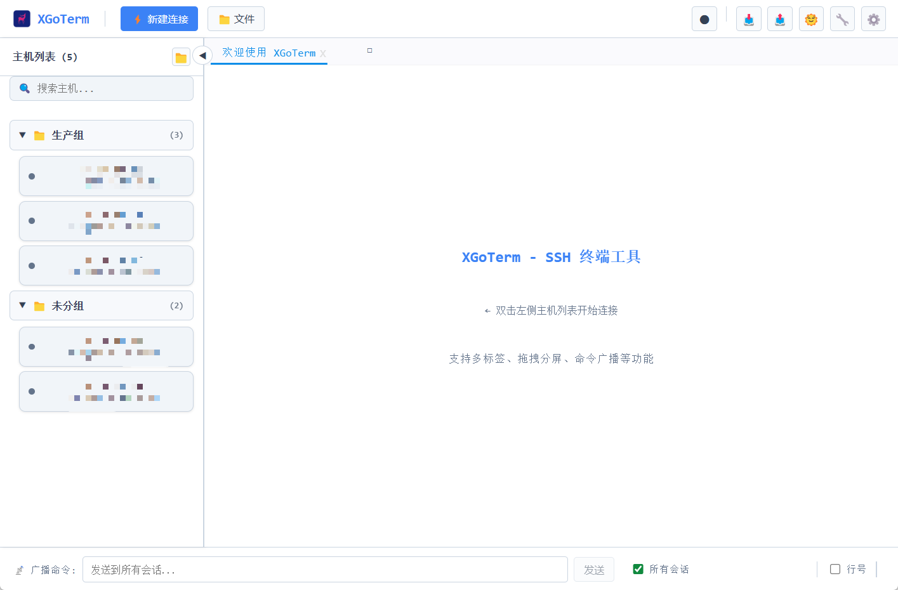
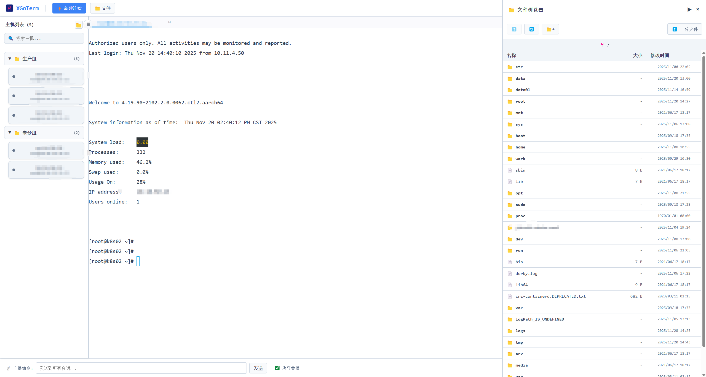

# XGoTerm

<div align="center">


**现代化、功能丰富的 SSH 终端客户端（Windows）**

[](https://opensource.org/licenses/Apache-2.0)
[](https://go.dev/)
[](https://wails.io)
[](https://reactjs.org/)
[](https://www.typescriptlang.org/)

[English](README.md) | [简体中文](README_zh.md)

</div>

---

## 📖 项目简介

**XGoTerm** 是一款基于 **Go** 和 **React** 开发的强大现代化 SSH 终端客户端，由 **Wails** 框架驱动。作为 Xshell 的免费开源替代品，它提供企业级特性，包括多标签会话管理、SFTP 文件管理、会话录制和跳板机支持。

### ✨ 核心特性

- 🚀 **多标签终端** - 直观的标签页界面同时管理多个 SSH 会话
- 📁 **内置文件浏览器** - 通过 SFTP 浏览、上传、下载和管理远程文件，实时显示传输进度
- 🎯 **跳板机支持** - 通过堡垒机/跳板机连接，透明的 SSH 转发
- 📝 **会话录制** - 将终端会话录制为 Markdown 文件，便于文档编写和审计追踪
- 🔐 **加密配置** - 使用 AES 加密安全存储 SSH 凭证
- 🎨 **现代化界面** - 简洁、响应式的界面，支持主题切换（深色/浅色模式）
- ⚡ **高性能** - 使用 Go 构建，速度快且资源占用低
- 🔌 **Web 预览** - 直接从保存的主机配置打开 Web 服务
- 📋 **命令广播** - 同时向多个会话发送命令
- 💾 **导入/导出** - 备份和恢复主机配置（.xgth 格式）

---

## 🖼️ 界面截图

<div align="center">

### 主界面


### 文件浏览器


### 多会话管理


</div>

---

## 🚀 快速开始

### 系统要求

- **Windows 10/11**（64位）
- **WebView2 运行时**（Windows 11 通常已预装）

### 下载与安装

#### 方式一：下载可执行文件（推荐）

1. 前往 [发布页面](https://github.com/yourusername/xgoterm/releases)
2. 下载最新的 `xgoterm-windows-amd64.exe`
3. 直接运行 - 无需安装！

#### 方式二：从源码构建

```bash
# 克隆仓库
git clone https://github.com/yourusername/xgoterm.git
cd xgoterm

# 安装依赖
go mod download
cd frontend && npm install && cd ..

# 构建
wails build

# 开发模式运行
wails dev
```

---

## 📚 使用指南

### 连接服务器

1. 点击顶部栏的 **"+ 新建连接"** 按钮
2. 填写连接信息：
   - **主机地址**：服务器 IP 地址或主机名
   - **端口**：SSH 端口（默认：22）
   - **用户名**：SSH 用户名
   - **认证方式**：选择密码或私钥
3. 点击 **"连接"** 建立连接

### 使用文件浏览器

1. 点击 **"📁 文件"** 按钮打开文件浏览器
2. 双击文件夹浏览远程目录
3. **右键点击**文件/文件夹进行操作：
   - **下载**：将文件保存到本地
   - **删除**：删除文件/文件夹
   - **重命名**：重命名文件/文件夹
4. **上传文件**：点击 "⬆️ 上传文件" 或拖放文件
5. **折叠**：点击 "▶" 最小化浏览器，同时保持传输活动

### 跳板机配置

1. 打开连接设置
2. 启用 **"使用跳板机"**
3. 配置堡垒机：
   - 跳板机地址和端口
   - 跳板机凭证
4. 配置目标主机
5. 连接 - XGoTerm 会自动通过跳板机建立隧道

### 会话录制

1. 点击顶部栏的 **🔴 录制图标**开始录制
2. 所有终端输出将保存到 Markdown 文件
3. 再次点击停止录制
4. 在 `recordings/` 目录中查找录制文件

---

## 🛠️ 开发指南

### 技术栈

**后端（Go）**
- [Wails v2](https://wails.io) - 桌面应用框架
- [golang.org/x/crypto/ssh](https://pkg.go.dev/golang.org/x/crypto/ssh) - SSH 客户端
- [github.com/pkg/sftp](https://github.com/pkg/sftp) - SFTP 实现

**前端（React + TypeScript）**
- [React 18](https://reactjs.org/) - UI 框架
- [TypeScript](https://www.typescriptlang.org/) - 类型安全
- [xterm.js](https://xtermjs.org/) - 终端模拟器
- [Vite](https://vitejs.dev/) - 构建工具
- [rc-dock](https://github.com/ticlo/rc-dock) - 停靠布局

### 项目结构

```
xgoterm/
├── main.go              # 应用程序入口
├── app.go               # 应用生命周期和对话框
├── term_manager.go      # SSH 会话管理
├── file_manager.go      # SFTP 文件操作
├── profiles_manager.go  # 主机配置存储
├── frontend/
│   ├── src/
│   │   ├── App.tsx           # 主 React 组件
│   │   ├── components/
│   │   │   ├── TerminalTab.tsx    # 终端界面
│   │   │   ├── FileBrowser.tsx    # 文件管理器
│   │   │   ├── Sidebar.tsx        # 主机列表
│   │   │   └── Topbar.tsx         # 顶部导航
│   │   └── wailsjs/          # 自动生成的 Go 绑定
│   └── package.json
├── go.mod
└── wails.json
```

### 构建

```bash
# 开发模式（热重载）
wails dev

# 生产构建
wails build

# 为特定平台构建
wails build -platform windows/amd64
```

### 运行测试

```bash
# 后端测试
go test ./...

# 前端测试
cd frontend && npm test
```

---

## 🤝 贡献指南

我们欢迎贡献！请遵循以下步骤：

1. **Fork** 本仓库
2. **创建**特性分支（`git checkout -b feature/amazing-feature`）
3. **提交**更改（`git commit -m 'Add some amazing feature'`）
4. **推送**到分支（`git push origin feature/amazing-feature`）
5. **打开** Pull Request

### 代码风格

- **Go**：遵循 [Effective Go](https://go.dev/doc/effective_go) 指南
- **TypeScript/React**：遵循 [Airbnb 风格指南](https://github.com/airbnb/javascript)
- 提交前运行 `go fmt` 和 `npm run lint`

---

## 🗺️ 开发路线图

- [ ] **多平台支持**（macOS、Linux）
- [ ] **SSH 密钥管理界面**
- [ ] **端口转发**（本地/远程/动态）
- [ ] **SFTP 目录递归下载**
- [ ] **文件预览**（文本、图片、代码）
- [ ] **在线文件编辑器**（语法高亮）
- [ ] **命令历史**搜索和自动补全
- [ ] **自定义主题**和配色方案
- [ ] **插件系统**
- [ ] **多语言支持**（英语、中文、日语）

---

## 📄 开源协议

本项目采用 **Apache License 2.0** 协议 - 详见 [LICENSE](LICENSE) 文件。

```
Copyright 2025 XGoTerm Contributors

Licensed under the Apache License, Version 2.0 (the "License");
you may not use this file except in compliance with the License.
You may obtain a copy of the License at

    http://www.apache.org/licenses/LICENSE-2.0

Unless required by applicable law or agreed to in writing, software
distributed under the License is distributed on an "AS IS" BASIS,
WITHOUT WARRANTIES OR CONDITIONS OF ANY KIND, either express or implied.
See the License for the specific language governing permissions and
limitations under the License.
```

---

## 🙏 致谢

- [Wails](https://wails.io) - 出色的 Go + Web 框架
- [xterm.js](https://xtermjs.org/) - 强大的终端模拟器
- [golang.org/x/crypto](https://pkg.go.dev/golang.org/x/crypto) - 优秀的 SSH 实现
- 所有 [贡献者](https://github.com/yourusername/xgoterm/graphs/contributors)

---

## 📞 联系与支持

- **问题反馈**：[GitHub Issues](https://github.com/yourusername/xgoterm/issues)
- **讨论交流**：[GitHub Discussions](https://github.com/yourusername/xgoterm/discussions)
- **邮箱**：your-email@example.com

---

<div align="center">

**如果你觉得 XGoTerm 有用，请在 GitHub 上给我们一个 ⭐️！**

由 XGoTerm 团队用 ❤️ 打造

</div>
